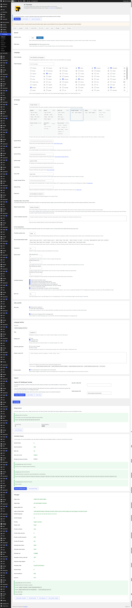
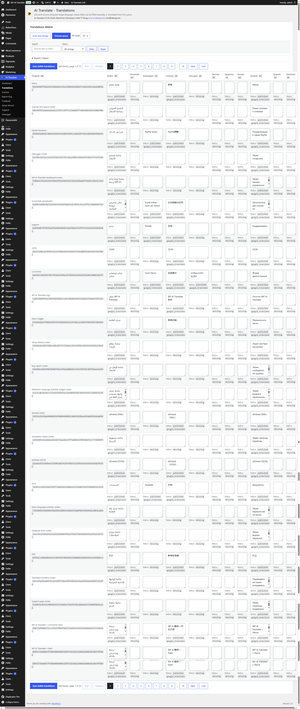
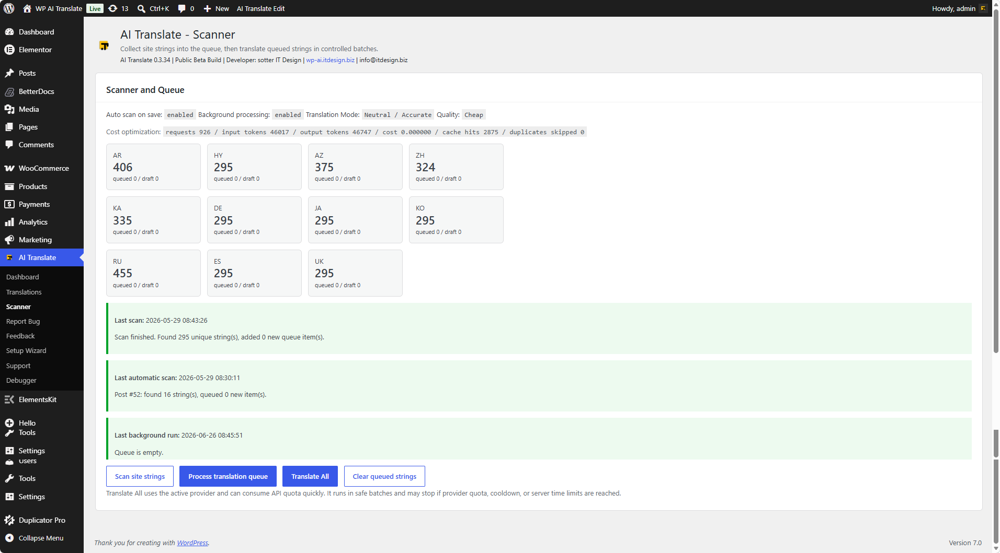
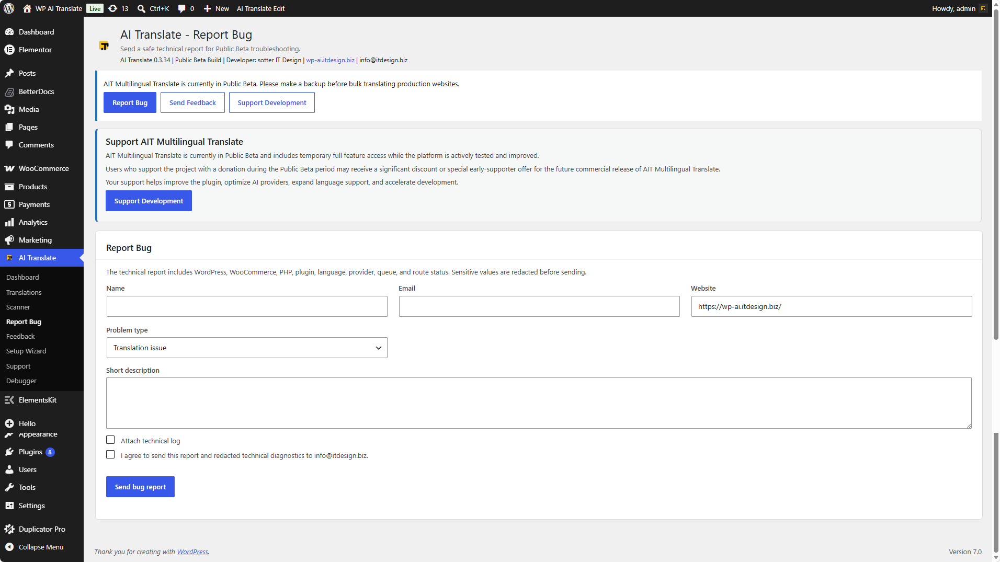
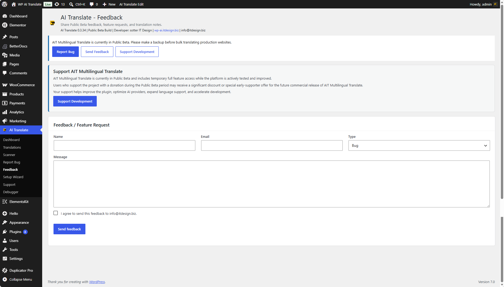
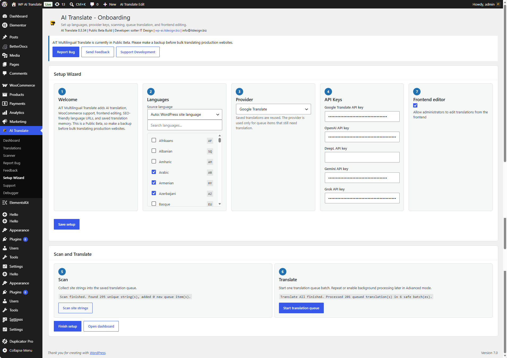
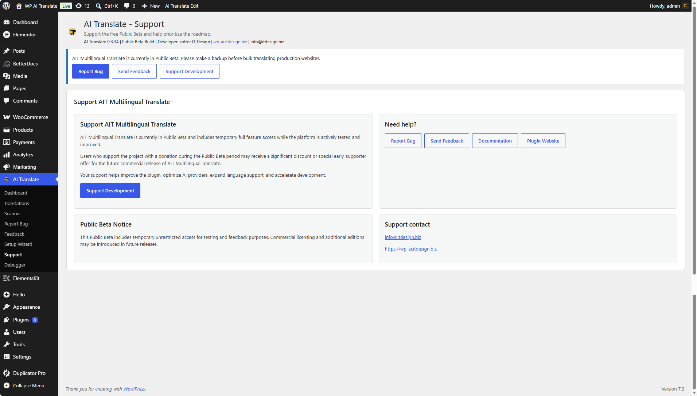
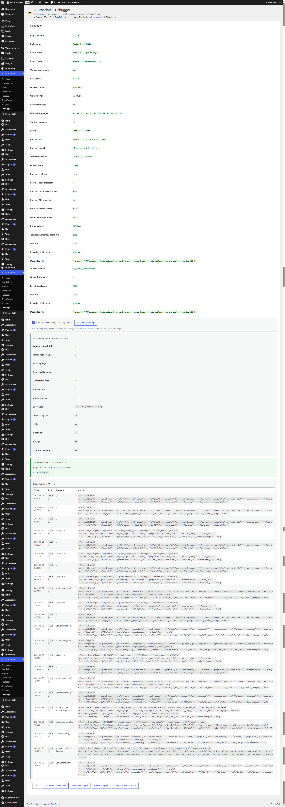
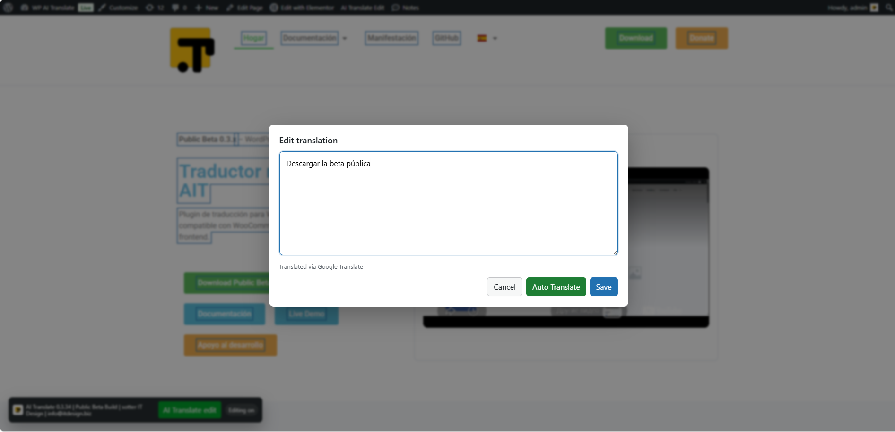

# AIT Multilingual Translate

[](https://wordpress.org/plugins/ait-multilingual-translate/)
[](https://www.php.net/)
[](LICENSE)
[](CHANGELOG.md)
[](https://wordpress.org/plugins/ait-multilingual-translate/)

AIT Multilingual Translate is an AI-powered multilingual translation plugin for WordPress. It helps site owners scan content, queue translations, reuse saved translations, edit translated text on the frontend, and publish multilingual pages with SEO-friendly language URLs.

- Website: https://wp-ai.itdesign.biz/
- WordPress.org: https://wordpress.org/plugins/ait-multilingual-translate/
- Repository: https://github.com/IT-Design-s-r-o/wp-ai-translate
- Documentation: https://wp-ai.itdesign.biz/documentation/

## Features

- AI-assisted translation for WordPress content, menus, widgets, taxonomy terms, public custom fields, and SEO metadata.
- Local translation memory so identical source text can be reused instead of sent repeatedly to a provider.
- Translation queue for controlled, batch-based translation workflows.
- Scanner for collecting translatable strings before processing.
- Translation Matrix for searching, reviewing, editing, saving, importing, and exporting translations.
- Frontend Editor for administrator-only visual translation edits on the live site.
- SEO-friendly language routing with directory URLs or query-string URLs.
- Language switchers for shortcodes, widgets, menus, automatic header/footer placement, and Elementor.
- WooCommerce compatibility for product and store content workflows.
- Setup Wizard for first-run configuration.
- Debugging tools for provider tests, route diagnostics, queue status, and safe log export.

## AI Providers

AIT Multilingual Translate can work with multiple administrator-configured providers:

- OpenAI
- Google Gemini
- xAI / Grok
- Google Cloud Translation
- DeepL

No API key is bundled with the plugin. Provider keys can be saved in plugin settings or defined in `wp-config.php` constants where supported.

## Translation Queue

The queue is designed for production-friendly translation workflows. Missing strings can be collected, reviewed, and translated in controlled batches instead of forcing visitors to wait for provider calls during page load.

Queue processing supports manual runs and background processing through WP-Cron, with conservative batch sizes recommended for live sites.

## Frontend Editor

The Frontend Editor lets administrators edit translated text visually from the website frontend. It supports manual edits, provider-assisted auto-translation, previewing, and saving translations back into local translation memory.

## SEO Friendly URLs

AIT Multilingual Translate supports:

- Directory mode, such as `/de/about/`
- Query mode, such as `/about/?lang=de`
- Remembered visitor language selection
- Language-aware links for menus and switchers

## Elementor Support

The plugin includes Elementor workflow support, including a language switcher widget and compatibility with translated frontend output.

## WooCommerce Support

AIT Multilingual Translate is built with WooCommerce stores in mind. It can scan and translate product-facing content while keeping provider usage queue-based and reviewable.

## Scanner

The scanner collects text from common WordPress content sources, including posts, pages, products, menus, widgets, taxonomy terms, SEO fields, and selected public custom fields.

## Translation Memory

Translations are stored locally and reused while the source text remains unchanged. This helps reduce repeated provider requests and keeps translated output consistent across the site.

## Setup Wizard

Use the Setup Wizard to configure the source language, target languages, provider settings, and first translation workflow.


## GIF Demonstrations

| Workflow | Demo |
| --- | --- |
| Setup Wizard | Available above: `Setup-Wizard.gif` |
| Scanner | Available: `scaner.gif` |
| Frontend Editor | Placeholder: add the Frontend Editor GIF when available. |
| Translation Matrix | Available: `Translations-Matrix.gif` |
| Queue | Placeholder: add the Queue GIF when available. |

### Scanner


### Translation Matrix


## Screenshots

| Screenshot | Caption |
| --- | --- |
|  | Dashboard and main plugin overview. |
|  | Setup Wizard for first-run language and provider configuration. |
|  | Source and target language settings. |
|  | AI provider configuration and API key settings. |
|  | Language switcher display and placement options. |
|  | Scanner workflow for collecting translatable strings. |
|  | Queue controls for processing translations in batches. |
|  | Translation Matrix for reviewing, editing, filtering, importing, and exporting translations. |
|  | Frontend Editor workflow for visual translation editing. |

## WordPress.org Assets

The repository release assets include:

- `banner-772x250.png`
- `banner-1544x500.png`
- `icon-128x128.png`
- `icon-256x256.png`
- `screenshot-1.png` through `screenshot-9.png`

These assets are prepared for the WordPress.org plugin directory listing and GitHub documentation.

## Installation

1. Install AIT Multilingual Translate from the WordPress.org Plugin Directory, or upload the release ZIP through **Plugins > Add New > Upload Plugin**.
2. Activate **AIT Multilingual Translate**.
3. Open the plugin admin menu in WordPress.
4. Run the Setup Wizard.
5. Choose the source language and target languages.
6. Configure an AI provider and API key.
7. Run the Scanner.
8. Process the Translation Queue.
9. Add a language switcher with a shortcode, widget, menu item, automatic placement, or Elementor widget.

## Requirements

- WordPress 6.0 or newer
- PHP 7.4 or newer
- HTTPS recommended for production sites
- Provider API key for AI or machine translation
- WooCommerce optional
- Elementor optional

## Shortcodes

```text
[aitmt_language_switcher]
```

## FAQ

### Does AIT Multilingual Translate translate every page on every visit?

No. The recommended workflow is scanner plus queue processing. This keeps provider calls controlled and avoids slowing down visitor page loads.

### Are API keys included?

No. Site administrators must configure their own provider API keys.

### Where are translations stored?

Translations are stored locally in WordPress so they can be reused by translation memory.

### Can I edit translations manually?

Yes. Translations can be edited from the Translation Matrix and, for administrators, through the Frontend Editor.

### Does it support SEO-friendly multilingual URLs?

Yes. The plugin supports directory-based URLs and query-string language URLs.

### Does it support Elementor?

Yes. Elementor workflows are supported, including a language switcher widget.

### Does it support WooCommerce?

Yes. The plugin includes WooCommerce-aware translation workflows for product and store content.

## Roadmap

- Additional provider setup guides.
- More visual workflow demos.
- Expanded WooCommerce translation coverage.
- More granular translation mode controls per content type.
- Improved reporting for queue processing and provider usage.
- More automated compatibility checks for major page builders.

## Changelog

See [CHANGELOG.md](CHANGELOG.md).

## Contributing

Contributions are welcome through issues and pull requests. Please read [CONTRIBUTING.md](CONTRIBUTING.md) before opening a pull request.

## Security

Please report security issues privately. See [SECURITY.md](SECURITY.md).

## License

AIT Multilingual Translate is licensed under GPLv2 or later. See [LICENSE](LICENSE).

