# WP AI Translate

AI-powered WordPress translation plugin for WordPress, WooCommerce, and Elementor.

---

## Public Beta

Current version: `0.3.23 Professional Beta`

WP AI Translate is currently in active Public Beta development.

The plugin focuses on:

* AI-powered translations
* WooCommerce compatibility
* Elementor integration
* SEO-friendly multilingual URLs
* translation queue processing
* frontend visual editing
* lightweight architecture

---

# Features

## AI Providers

Supported providers:

* OpenAI
* Gemini
* Grok / xAI
* Google Translate
* DeepL

Planned:

* Claude / Anthropic

---

## Translation Engine

* Translation queue system
* Saved translation memory
* Automatic scanner
* WP-Cron queue processing
* Controlled translation batches
* Dynamic frontend string collection
* Translation reuse system

---

## WordPress Integration

* WordPress pages/posts
* WooCommerce products
* taxonomy terms
* menus
* SEO metadata
* public custom fields

---

## Elementor Integration

* Elementor language switcher widget
* visual controls
* dropdown/list/buttons layouts
* typography and styling controls
* responsive support

---

## Frontend Editing

* Live frontend translation editor
* administrator-only editing
* visual translation updates

---

# Screenshots

## Dashboard

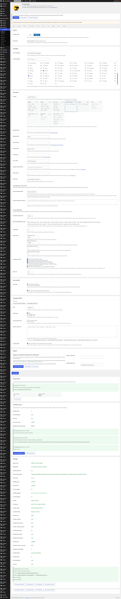

## Scanner and Queue

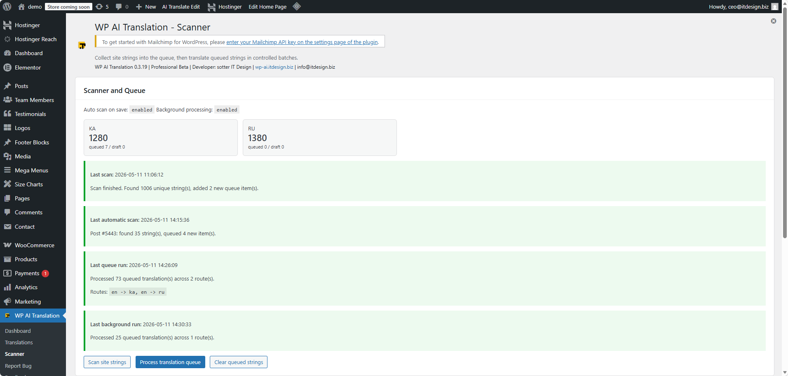

## Translation Matrix

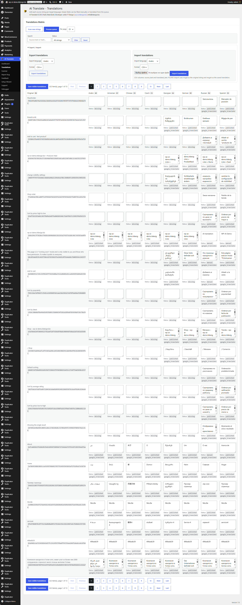

## Setup Wizard

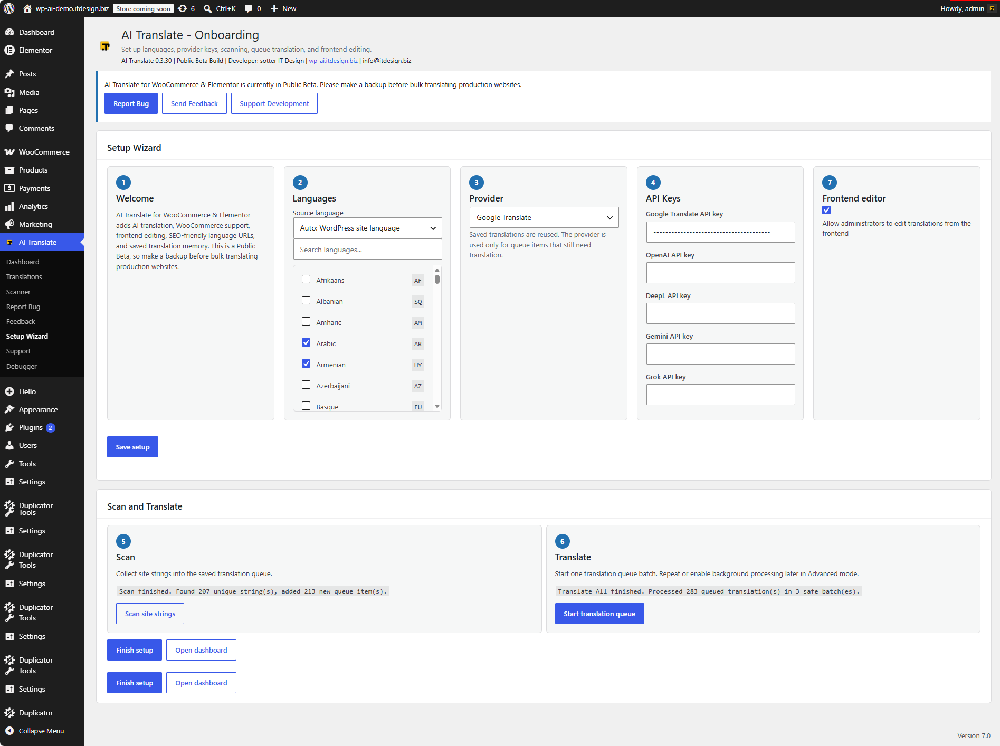

## Elementor Widget

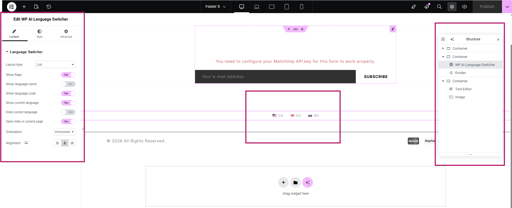

## Frontend Editing

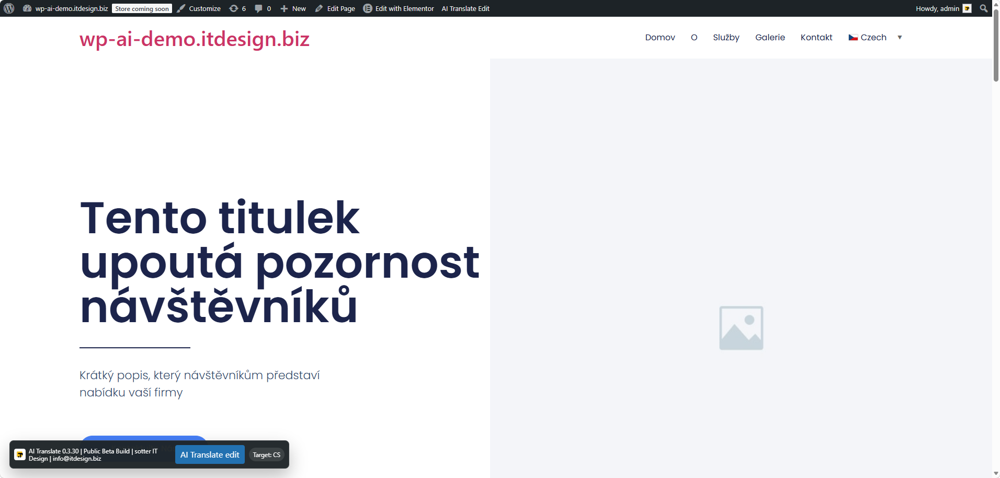

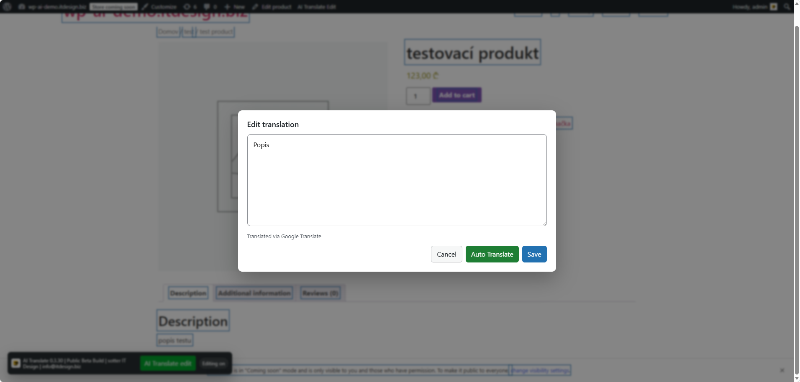

## Menu Widget

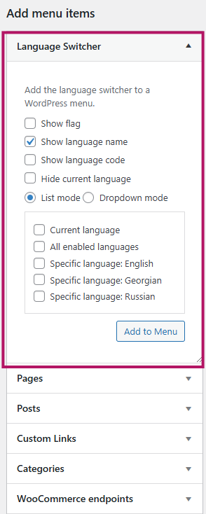

## Debugger

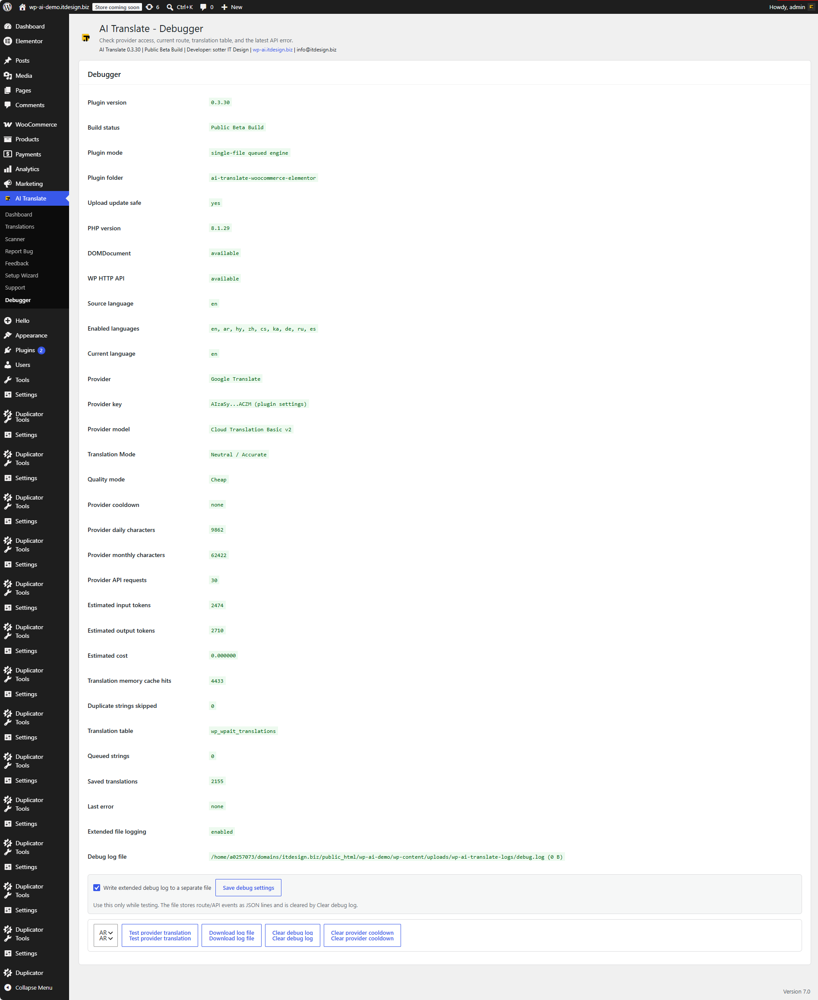

## Feedback System

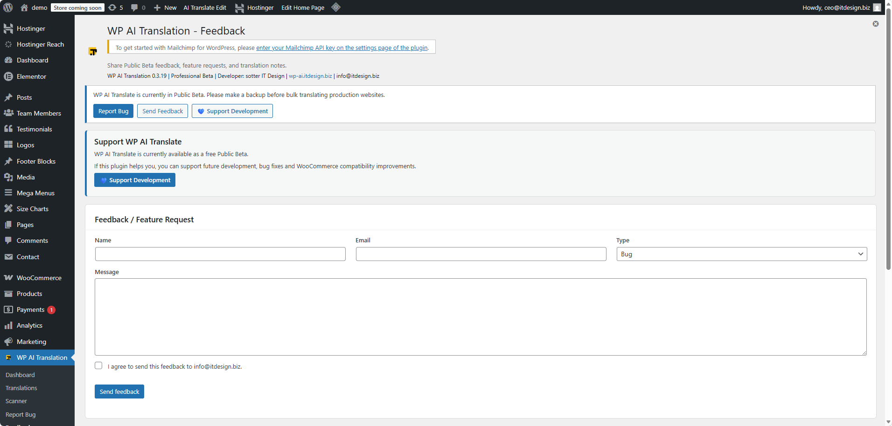

## Support Page

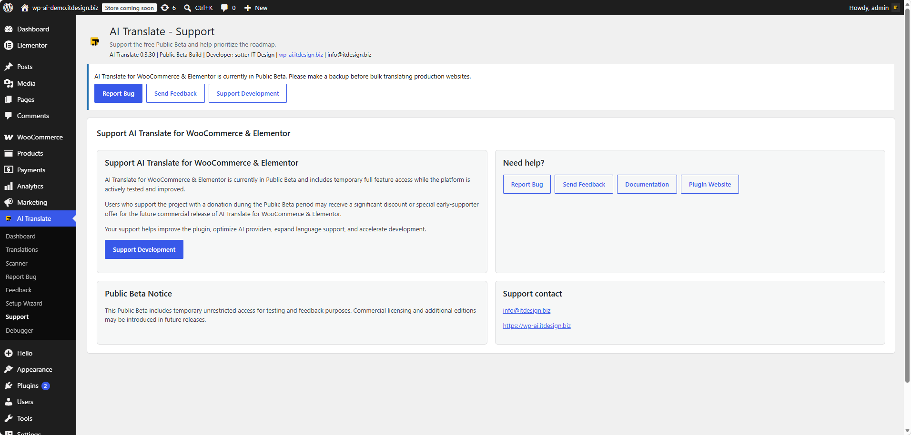

## Bug Reporting

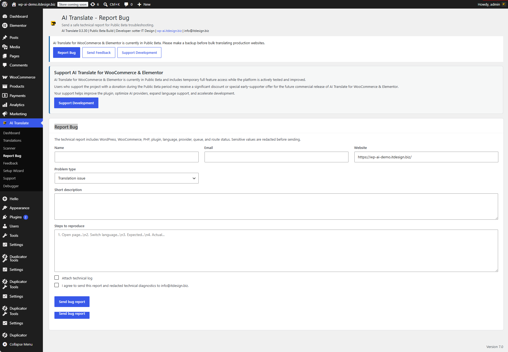

---

# Installation

1. Upload the plugin folder to:

/wp-content/plugins/wp-ai-translate/

2. Activate the plugin

3. Open:

WP AI Translation

4. Configure:

* languages
* provider
* API keys

5. Scan site strings

6. Start queue translation

---

# Shortcodes

[wp_ai_translate_switcher]

[ai_language_switcher]

# Requirements

* WordPress 6+
* PHP 8+
* WooCommerce optional
* Elementor optional

---

# Roadmap

See:

[ROADMAP.md](ROADMAP.md)

---

# Security

See:

[SECURITY.md](SECURITY.md)

---

# Support

* https://wp-ai.itdesign.biz
* [info@itdesign.biz](mailto:info@itdesign.biz)

---

# License

GPL-2.0-or-later

https://www.gnu.org/licenses/gpl-2.0.html
